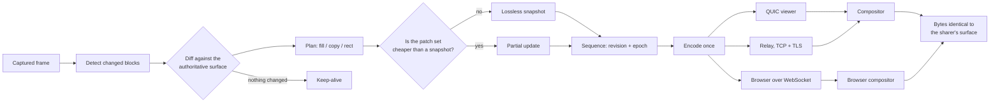

<div align="center">

# PixelChangeCheck

**Lossless desktop replication: send only the pixels that changed.**

[](https://github.com/carterlasalle/PixelChangeCheck/actions/workflows/ci.yml)
[](https://github.com/carterlasalle/PixelChangeCheck/actions/workflows/release.yml)


[Install](#quick-start) · [Usage](docs/usage.md) · [How it works](#how-pcc-works) · [Architecture](#architecture) · [Relay](#do-i-need-a-relay) · [Limitations](#known-limitations) · [Design records](docs/adr/)

</div>

A conventional screen stream re-encodes the whole picture every frame. PixelChangeCheck keeps a **lossless authoritative surface**: the sharer diffs each captured frame against the framebuffer viewers actually hold, and sends only what changed. For a terminal, an IDE, or a document, that is usually a few kilobytes per frame. When nothing changes, it sends nothing but a keep-alive.

It shares to a **native viewer** over QUIC, to **any web browser** including a phone over a WebSocket that speaks the same change protocol, or to **a relay** when both ends are behind NAT.

## How it works



The diff is against the **reference** — the framebuffer an up-to-date viewer holds — not against the previous capture. That is what makes sub-threshold changes accumulate instead of being discarded forever. The reference advances only over rectangles that actually shipped, so anything too small to send this frame is still there to send later.

## Capabilities

| Area | What PixelChangeCheck provides |
|---|---|
| Detection | Allocation-free block comparison, tile-hash region merging, and a bounded verified-displacement search for scroll reuse |
| Representation | A three-way choice per region: solid fill, verified copy, or an exact LZ4 patch — whichever is genuinely cheaper |
| Cost control | When the patches for a frame would cost more than a fresh lossless snapshot, the sharer sends the snapshot instead |
| Snapshots | Chunked and atomic (begin/chunk/commit), so an interrupted snapshot can never half-replace a working surface |
| Sequencing | One authority for revisions and epochs, so a late joiner, a recovered viewer, and a viewer that fell behind all converge to the same pixels |
| Authentication | A viewer token authorizes access; a certificate pin proves who you are talking to |
| Encryption | Every frame sealed end to end, per viewer, on the native path and in the browser |
| Relay | Per-viewer byte budgets, generational ownership, a defined slow-viewer policy, and no inspection of frame contents |
| Reachability | An explicit ladder — global IPv6, STUN, NAT-PMP, an ICE-lite peer check — with the relay as the deliberate last rung |
| Observability | A stats table, Prometheus metrics on loopback, and JSON logs for bug reports |
| Viewers | A native window, and a WebSocket compositor for any browser, with an explicitly lossy MJPEG fallback |
| Transports | Direct QUIC, multi-relay fan with redirect-based broadcast mode, iroh tickets (ADR 0007), and manual-signalling WebRTC data channels (ADR 0008) |

## Quick start

### Prerequisites

- Rust 1.91 or newer (see `rust-version` in `Cargo.toml`)
- System dependencies, **Linux only** (macOS/Windows: none). Each entry
  is here because a release run failed without it or the lockfile proves
  the probe — never vibes. Install them all at once:

  | You install | Because | Chain |
  |---|---|---|
  | `pkg-config` | every `-sys` probe needs the tool itself | — |
  | `libasound2-dev` | audio capture links ALSA | `alsa-sys` ← `alsa` ← `cpal` ← `audio` feature |
  | `libdbus-1-dev` | display enumeration over D-Bus | `libdbus-sys` ← `dbus` ← `screenshots` |
  | `libegl-dev`, `libgbm-dev` | GBM/EGL screen capture — a release run failed in `khronos-egl`'s probe without them | `khronos-egl` + `gbm-sys` ← `gl`/`gbm` ← `libwayshot-xcap` ← `xcap` |
  | `libpipewire-0.3-dev` | PipeWire screen capture — a release run failed in `libspa-sys`'s probe without it | `libspa-sys` ← `pipewire` ← `xcap` (not cpal — cpal's Linux audio is ALSA-only) |
  | `libwayland-dev` | Wayland capture + native window — a release run failed in `wayland-sys`'s probe without it | `wayland-sys` ← `wayland-backend` ← `gbm`/`libwayshot-xcap` ← `xcap`, and `wayland-sys` ← `minifb` (`native-viewer` feature) |
  | `libxcb1-dev` | X11 display info | `xcb` ← `display-info`/`screenshots`/`xcap` (all three list it directly) |
  | `libx11-dev` and friends | the cursor pointer queries X11 | `x11` ← `device_query` ← capture (cursor sampler; `xlib` feature only, so the probe that fires today is `x11` itself — the rest of `x11`'s build-script list fires only on cargo features nothing enables) |
  | `libudev-dev`, `libxkbcommon-dev`, `libxrandr-dev` | **kept, unverified** — no `libudev-sys`, `xkbcommon-sys`, or enabled `xrandr` probe anywhere in `Cargo.lock`. They ride with the stacks above on every real system, and dropping a working dep blind to prove a point risks the next release run. Prove-or-drop on the next'Dependencies bump: remove one, watch the Ubuntu release leg, keep or restore on evidence. |

  Two things this table deliberately does **not** list:

  - `libopus-dev`: worth installing (`apt install libopus-dev`, or
    `brew install opus` on macOS) so the build links the system Opus
    instead of compiling a vendored copy with cmake — but optional,
    because the vendored build works without it. Set `OPUS_LIB_DIR` /
    `OPUS_LIB_STATIC` only if you need to point at a non-standard
    install; the default finds pkg-config's answer.
  - Anything for `--no-default-features`: that build drops `cpal`/Opus
    (no ALSA, no libopus cmake) and `minifb` (no X11/Wayland headers),
    so a headless relay needs only `pkg-config` plus the capture rows.
    The capture stack itself (`screenshots`, `display-info`, `xcap`,
    `device_query`) is **not** feature-gated — that is the honest gap
    in the table above, and gating it is future work, not a flag that
    exists today.

### Install

The fastest route is a prebuilt binary — no compiler, no system
headers, no twenty-minute build. `binstall` is a separate tool, so
install it once first:

```sh
cargo install cargo-binstall
cargo binstall pixel-change-check-client
```

That downloads the release archive for your platform from the
[releases page](https://github.com/carterlasalle/PixelChangeCheck/releases)
and installs one binary, `pcc`. The archives are named
`pcc-<version>-<target>` (`.tar.gz`, `.zip` on Windows), covering
`x86_64` and ARM Linux, Apple Silicon Macs, and `x86_64` Windows. Intel
Macs are not covered: GitHub retired the last Intel macOS runner, so
there is no `x86_64-apple-darwin` archive — install from source there,
or run the Apple Silicon build under Rosetta 2.

> **If `pcc` runs a C compiler:** the name collides with the Portable C
> Compiler, which some systems put earlier on PATH. `pcc share` answering
> `clang: error: unknown argument` means you are running clang, not this
> tool. Check `which -a pcc`, then use the cargo path directly
> (`~/.cargo/bin/pcc …`) or fix PATH order. Confirm with
> `pcc --version` — it must print `pcc 0.1.x`, and anything else is the
> wrong binary.

From source, on any machine with a Rust toolchain:

```sh
cargo install pixel-change-check-client --locked
```

`--locked` matters: the committed `Cargo.lock` pins every transitive
dependency, so the build you get is the build CI tested rather than
whatever is newest today. The default build includes audio capture and
the native window. A headless machine that needs neither — a relay
host, a CI runner — can skip the system libraries entirely:

```sh
cargo install pixel-change-check-client --locked --no-default-features
```

That drops cpal/Opus (no ALSA headers, no vendored libopus cmake
build) and minifb (no X11/Wayland dev headers); the web viewer and
every transport keep working. With default features on Linux you still
need the system dependencies above, because the capture path links
against them.

> **Headless/CI rule of thumb:** if a source build fails on a system
> library (`libpipewire`, `libasound`, `wayland-client`, …) and this
> machine only runs a relay — or never opens a window — stop installing
> `-dev` packages: you want `--no-default-features`, not more headers.
> The build error cannot say this (cargo owns that output), so the docs
> say it here instead.

A note on Opus specifically: with `libopus-dev` (Debian/Ubuntu) or
`opus` (Homebrew) plus `pkg-config` installed, the build links the
system library instead of compiling a vendored copy with cmake (see
the prerequisites table above for why it stays optional). That one
package is the difference between a pure-Rust build and a C toolchain
step. There is deliberately no `.cargo/config.toml` forcing a linker
here, so nothing about that choice is hidden: the default build works
with stock `rustup`, and faster linkers stay opt-in.

### Share your screen

```sh
pcc share
```

That prints the certificate fingerprint and a complete, copy-pasteable
viewer command:

```text
Certificate fingerprint (sha256): 9f2c...
Browser viewer: http://127.0.0.1:8080/#token=ABC...
Direct viewers on 0.0.0.0:5800
  pcc view --connect 192.168.1.20:5800 --token ABC... --pin 9f2c...
```

The browser line is loopback because `--web` defaults to loopback: a
non-loopback browser address without `--web-cert`/`--web-key` is refused
rather than served over plaintext. The direct line prints the reachable
address on your network (see below); the relay line, when `--relay` is
set, prints the exact viewer command with the relay pin substituted.

`pcc pair` prints a single line a viewer can open or paste, carrying both
the token and the pin, so nobody retypes a 64-character hex string.

### View it

**Native window**, on another machine:

```sh
pcc view --connect <sharer-ip>:5800 --token <token> --pin <fingerprint>
```

**Any browser**, including a phone: open

```text
http://<sharer-ip>:8080/#token=<token>
```

That page runs the same compositor as the native client. If your browser
cannot, `/fallback` serves a lossy MJPEG preview, labelled as such.

**Behind NAT on both ends?** Run a relay on any reachable host:

```sh
pcc relay --listen 0.0.0.0:5900 --web --cert relay.pem --cert-key relay-key.pem
```

`--web` makes the relay host the browser viewer too, on that same port
and behind that same certificate, so a viewer needs no binary and no
terminal — only a link. Use a real certificate (`--cert`/`--cert-key`,
see [`pcc relay` in the usage guide](docs/usage.md#pcc-relay--bridge-two-nats))
or browsers will warn.

It prints its own token and fingerprint. On the sharer:

```sh
pcc share --relay <relay-ip>:5900 --relay-pin <relay-fingerprint> --token <token>
```

which prints two one-line invites — one for a `pcc` viewer, one for a
browser:

```text
Viewer link: pcc://view?relay=<relay-ip>:5900&pin=<relay-fingerprint>&session=<code>&token=<token>
Browser link: https://<relay-ip>:5900/v/<code>/#token=<token>
```

Hand the viewer one of those. Nothing is retyped, and the pin is already
the right one (the relay's, not the sharer's).

Prefer not to copy the relay's pin out of its log at all? `pcc pair`
fetches it:

```sh
pcc pair --relay <relay-ip>:5900 --session <code> --token <token>
```

That reads the fingerprint from the relay's certificate over the network
and prints the same `pcc://` line. It is trust-on-first-use: compare the
printed fingerprint against whatever the relay operator published.

A native viewer can also take the pieces explicitly:

```sh
pcc view --relay <relay-ip>:5900 --pin <relay-pin> --session <session> --token <token>
```

### Do I need a relay?

Most of the time, no. Ask the tool:

```sh
pcc diagnose
```

It reports your local addresses, whether you have a *global* IPv6
address (a link-local one is not routable and saying otherwise sends you
down a dead end), whether there is a default route, and a STUN reflexive
address. Then:

```sh
pcc share --reach auto     # try IPv6, then STUN, then the relay
pcc share --reach direct   # refuse the relay rather than use it
pcc share --reach relay    # skip discovery
```

The relay is the **last** rung on purpose. It is TCP+TLS, so it already
traverses the corporate proxies that block UDP -- which is exactly where
a direct-only path fails. Symmetric NAT and UDP-blocking proxies are the
two cases nothing free fixes.

Running one is cheap here specifically: at roughly 570 bytes/frame, a
session is about 160 MB per viewer per hour. See `deploy/relay/` for a
free-tier setup.

### Browser over TLS

The web port is plaintext unless you give it a real certificate, because a
self-signed one would only produce a browser warning:

```sh
pcc share --web-cert cert.pem --web-key key.pem
```

The surface content is encrypted either way. A certificate stops the key
exchange itself from being readable on the wire.

### Commands

```sh
pcc share --help
pcc view --help
pcc relay --help
pcc diagnose
```

### Watching it work

```sh
pcc share --synthetic --stats-interval 5 --metrics-listen 127.0.0.1:9100
curl -s 127.0.0.1:9100/metrics
```

`--stats-interval` prints a table; `--metrics-listen` serves Prometheus
text on loopback. `RUST_LOG=pcc=debug` narrows the log, and
`--log-format json` is what you want in a bug report.

## How PCC works

1. Capture a frame.
2. Diff it against the **reference** -- the framebuffer an up-to-date
   viewer holds. The reference advances only over rectangles that actually
   shipped, so a change too small to send this frame is still there to be
   sent later.
3. If much of the screen moved as one displacement, verify it byte for
   byte and emit a `Copy`; hash agreement alone is never trusted.
4. Represent each remaining rectangle as a solid `Fill` or an exact,
   LZ4-compressed patch, whichever is smaller.
5. If the patches would cost more than a fresh lossless snapshot, send the
   snapshot instead.
6. Send nothing but a keep-alive if nothing changed.

The viewer applies each transaction atomically against a single
sequencing authority, and a `Copy` reads the surface as it was *before*
the transaction -- which is what lets two regions swap in one update.

## Architecture

```text
              capture
                 |
                 v
   reference  <- detect  <- current frame
   (what          |         ^
    viewers        v         |
    hold)      planner (fill / copy / rect, cost-based)
                 |
                 v
          snapshot  |  partial update      <- one sequencer: revision + epoch
                 |
                 v
        encoded ONCE, shared with every viewer
                 |
   +-------------+--------------+-------------------+
   v                            v                   v
QUIC viewer                relay (TLS)        web (WS / MJPEG)
   |                            |                   |
   v                            v                   v
Compositor  <--------------- forwards ------------> browser compositor
                                                     (a JS port of the same
                                                      state machine)
```

- **Sharer** (`pcc share`): captures, diffs against the reference, plans,
  encodes once, and fans the same bytes out to every viewer.
- **Viewer** (`pcc view`): authenticates, reconstructs through the
  `Compositor`, and presents.
- **Relay** (`pcc relay`): pairs a host with viewers by session code and
  forwards framed bytes. It authenticates a session with a value derived
  from the session token, so it never holds the secret that authenticates
  the end-to-end encryption handshake. A relay that learns that derived
  value still cannot forge a viewer's proof, and so cannot read a stream
  it claims not to be able to read.

## Safety model

The properties below are asserted by the test suite, not promised in
prose:

- **Exactness is measured.** After a snapshot plus its updates, a viewer's
  pixels are byte-identical to the sender's reference. The suite asserts
  exactly that, including over a real socket and through the browser's
  JavaScript compositor.
- **Malformed input is refused atomically.** A hostile frame length, an
  impossible geometry, or a truncated payload leaves the framebuffer
  unchanged and the revision unadvanced.
- **Revisions and epochs make out-of-order delivery harmless**, and a
  geometry change starts a new epoch instead of ending the share.
- **A wrong token is refused before any key agreement**, and a pinned
  certificate is what the client trusts -- not the CA chain.
- **A viewer that falls behind gets a fresh snapshot**, never silently
  dropped patches that later ones depended on.
- **Each viewer has its own keys.** The sharer's plaintext broadcast
  exists nowhere; it is sealed per viewer, which is what makes a
  per-viewer revocation meaningful on a broadcast path.
- **Budgets are tripwires, not silent truncation.** Every limit failure
  names the budget, the configured limit, and the observed value.

The reasoning behind these choices is in `docs/adr/`. The normative
roadmap is in `docs/spec/roadmap.md`.

## Known limitations

- A browser gets a sealed stream, but over a *different* primitive than
  the native client. `crypto.subtle` has no X25519 in the versions most
  people run, so the browser does ECDH on P-256 with HKDF and AES-GCM
  while the native client does X25519 with ChaCha20-Poly1305. The protocol
  shape is identical; the primitives differ. A certificate is still worth
  supplying, because it stops the key exchange from being readable on the
  wire, but the surface content is encrypted either way.
- Screen capture is full-frame; platforms that expose dirty rectangles
  (DXGI, ScreenCaptureKit, PipeWire) are not yet used to skip work.
- Motion video is not implemented. The exact-replication path is the
  product; see `docs/adr/0001-lossless-authoritative-surface.md` for why a
  lossy base is not an option, and `docs/adr/` for the rest.
- There is no input injection or clipboard sync.

## Documentation

| Document | Purpose |
|---|---|
| [Usage](docs/usage.md) | Every entry point — all five commands, every flag, the browser routes, the three transports — with how to invoke each |
| [Architecture decisions](docs/adr/) | Why the surface is lossless, how tokens and pins work, and how sequencing is enforced |
| [Roadmap](docs/spec/roadmap.md) | The specified workstreams and their definition of done |
| [Design](DESIGN.md) | Product and design guidance, including what was deliberately not built |
| [Contributing](CONTRIBUTING.md) | Development workflow, the release process, and the trusted-publisher setup |
| [Agent guidance](AGENTS.md) | Repository-specific instructions for coding agents |
| [Changelog](CHANGELOG.md) | What changed in each release |

## Contributing

Read [CONTRIBUTING.md](CONTRIBUTING.md) before making changes. The short
version:

```sh
cargo test                 # unit, replication, and real-socket end-to-end
cargo clippy --all-targets # lint, must be warning-free
cargo fmt --all -- --check
bash scripts/smoke.sh      # end-to-end against the real binaries
```

`scripts/smoke.sh` is the only check that exercises the CLI end to end.
`cargo test` passes while the printed pin does not work.

## License

AGPL-3.0-only. See [LICENSE](LICENSE).
